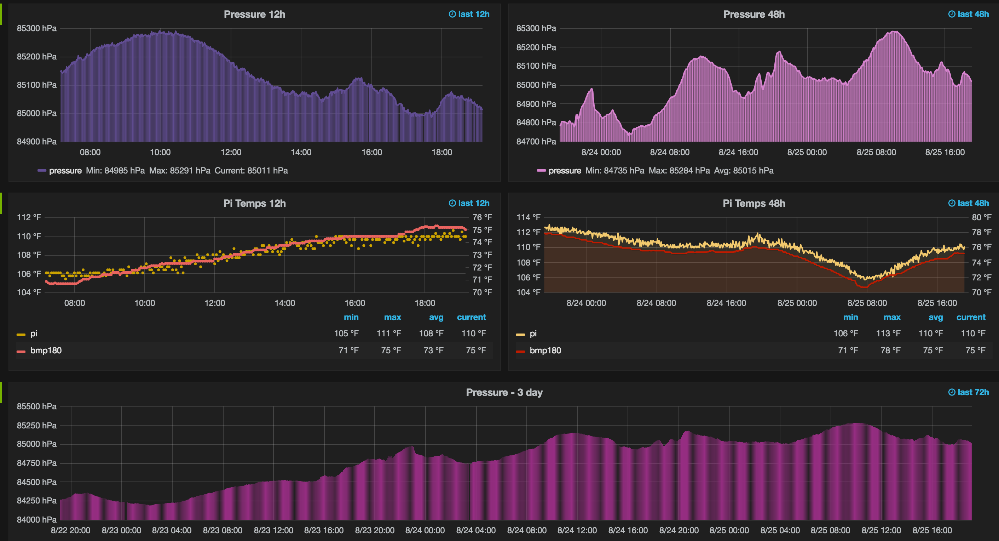

# pi_weather_mon
raspberry pi temp and pressure monitor to influx / grafana

Reference for small at home project with a raspberry pi, bmp180 temperature and pressure monitor and influx/grafana.

### Gathering the data on the Raspberry Pi

[Raspberry Pi Setup](raspberry_pi/README.md)

### Displaying the data with Grafana

[InfluxDB and Grafana Setup](influx_grafana/README.md)

### Example graph

