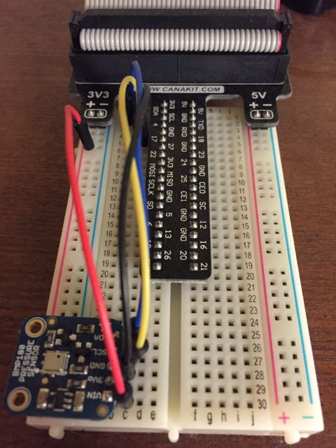
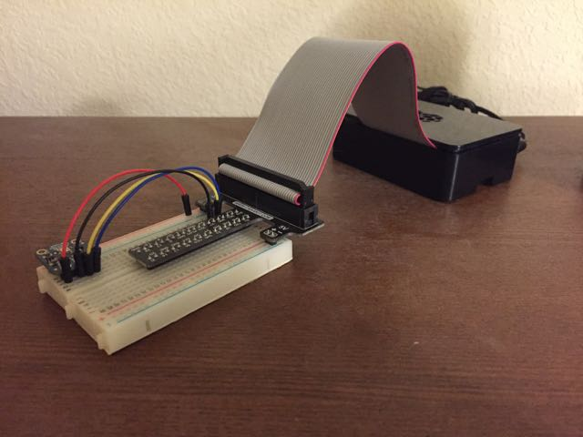

# Setting up the Raspberry Pi

## Physical Setup:
* Raspberry Pi 2 - see note
* [Adafruit BMP180 Temp and pressure sensor](https://www.adafruit.com/product/1603)
* Breadboard / wires to connect Pi to BMP180
* Soldering Iron, etc. to hook up the wires to the BMP180 board

#### Notes
* I used a [Raspberry Pi 2 kit from Canakit](https://www.canakit.com/raspberry-pi-starter-ultimate-kit.html), you
don't need all of what is there, but the breadboard, GPIO to breadboard
interface and cable are nice to work with.

## Software Setup:

First some apt-get:
```
sudo apt-get update
sudo apt-get install python-pip
sudo apt-get install build-essential python-dev python-smbus python-influxdb
```

The nice people at Adafruit have a good library for working with the BMP180 in python:
[Adafruit BMP180 python code](https://github.com/adafruit/Adafruit_Python_BMP)

(Snippets below are assuming you are a non root user, in this case 'pi' )
In my home directory - I made a projects directory - eg /home/pi/projects
In /home/pi/projects - I git cloned down the Adafruit_Python_BMP projects
Then, install some necessaries to get the library ready: - this is documented in
Adafruits repo in more detail - link above

`cd /home/pi/projects/Adafruit_Python_BMP` and then `sudo python setup.py install`

To test your BMP180 - in Adafruit_Python_BMP/examples, there should be a simpletest.py
from the command line:  `sudo python ./examples/simpletest.py`
you should get output like:
```
pi@raspberrypi ~/projects/Adafruit_Python_BMP/examples $ sudo python ./simpletest.py
Temp = 23.80 *C
Pressure = 85019.00 Pa
Altitude = 1455.98 m
Sealevel Pressure = 85021.00 Pa
```

Add some extra python things for future use:
```
sudo apt-get install python-pip
sudo pip install influxdb
```

Based on the Adafruit python code - make some scripts to gather data from the sensor:

1.  [Script to write to file](./temp_pressure_to_log.py)

2.  [Script to write to InfluxDB](./temp_pressure_toinflux.py)
note - to have this work, you'll need influx setup and will have to modify the variables for your influx server

### Scheduling the scripts to run:

You could write your own looping and timing, or just use cron.
This example uses cron (I'm lazy) and writes to file one every 5 min and writes to InfluxDB every minute
`crontab -e`
add lines like:
```
*/5 * * * * sudo python ~/projects/weather_mon/temp_pressure_tolog.py
* * * * * sudo python ~/projects/weather_mon/temp_pressure_toinflux.py
```

## Pictures:

BMP180 on breadboard:


Sensor and Pi setup:

